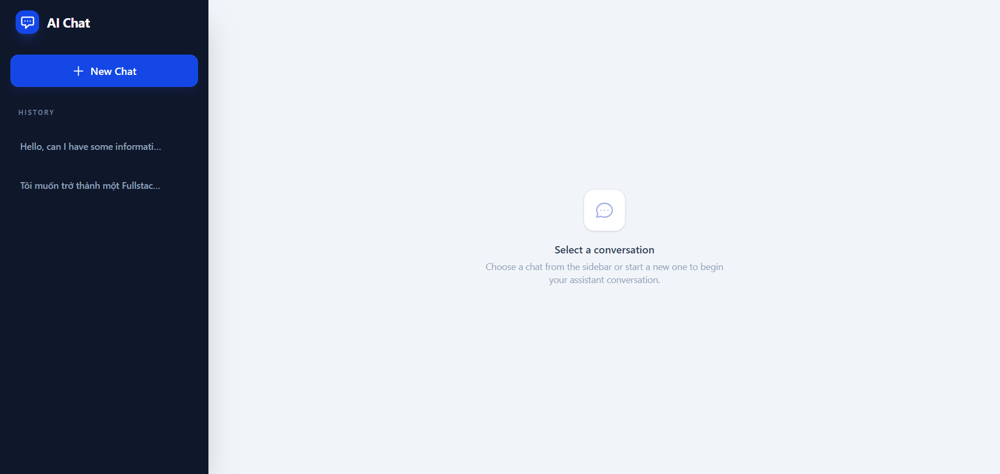
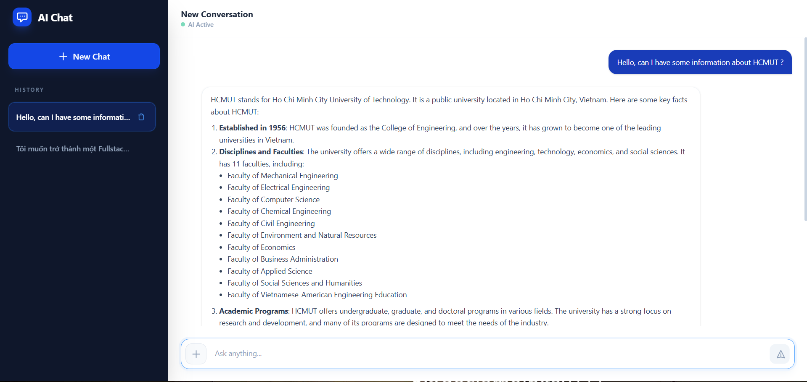

# AI Chat Application

A full-stack MERN application integrated with Groq AI, allowing users to converse with AI and attach files to their messages.

## Key Features

- **Interactive AI Chat:** Real-time conversation with Groq AI.
- **Contextual Awareness:** The AI maintains conversation history to provide contextual responses.
- **File Uploads:** Support for uploading files (images, documents) alongside prompts, enabling the AI to discuss the attached content.
- **Conversation Management:** Create new chats, view conversation history in the sidebar, and switch between different chat sessions.
- **Responsive UI:** A modern, responsive interface built with React and TailwindCSS.
- **Markdown Support:** Renders AI responses formatted in Markdown.

## Live Demo
- Front-end: https://ai-chat-gamma-rosy.vercel.app
- Back-end: https://ai-chat-yqti.onrender.com

The main page of the application looks like this:



The conversation UI of the application looks like this:



> [!NOTE]
> **Note:** The backend is hosted on Render Free Tier, so the first request after a period of inactivity may take a short time to wake the server.


## Technology Stack

### Frontend
- **Framework:** React 19 + Vite
- **Styling:** TailwindCSS 4
- **HTTP Client:** Axios
- **Markdown:** react-markdown & remark-gfm
- **Notifications:** react-hot-toast

### Backend
- **Framework:** Node.js + Express
- **Database:** MongoDB (via Mongoose)
- **AI Integration:** Groq API (using OpenAI SDK compatibility)
- **File Uploads:** Multer
- **Validation:** Zod

### AI Configuration
- **Provider:** Groq
- **Model:** llama-3.1-8b-instant

## Prerequisites

Before running the project, ensure you have the following installed:
- Node.js (v18 or higher recommended)
- MongoDB (local instance or MongoDB Atlas cluster)
- A Groq API Key
  - If you don't know how to get one, follow the Groq documentation: https://console.groq.com/docs/quickstart

## Getting Started

Follow these steps to set up the project locally.

### 1. Clone the repository

```bash
git clone <your-repository-url>
cd ai-chat
```

### 2. Backend Setup

Open a terminal (Command Prompt/PowerShell on Windows, or Terminal on macOS/Linux) and navigate to the backend directory, install dependencies, and create the `uploads` directory (required for file uploads). The commands below work for both Windows and macOS:

```bash
cd backend
npm install
mkdir uploads
```

Create a `.env` file in the `backend` directory based on `.env.example`:

```env
PORT=5000
MONGODB_URI=your-mongodb-connection-string
GROQ_API_KEY=your-groq-api-key
```

Start the backend development server:

```bash
npm run dev
```

### 3. Frontend Setup

Open a new terminal (Command Prompt/PowerShell on Windows, or Terminal on macOS/Linux) and navigate to the frontend directory:

```bash
cd frontend
npm install
```

Create a `.env` file in the `frontend` directory based on `.env.example`:

```env
VITE_API_BASE_URL=http://localhost:5000/api
```

Start the frontend development server:

```bash
npm run dev
```

## Project Structure

- `/backend`: Contains the Node.js/Express server code, database models, API routes, controllers, and upload middleware. The uploaded files are stored in `/backend/uploads`.
- `/frontend`: Contains the React application, UI components (ChatWindow, Sidebar, ChatInput), API service configurations, and styles.

## Usage

Once both servers are running, access the frontend application in your browser (typically at `http://localhost:5173`). 
You can type messages in the input area, use the '+' button to attach files, and press the Send button (or Enter) to communicate with the AI.
